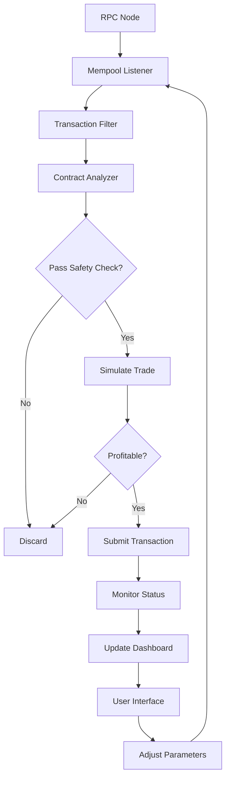

# 🌊 Ripple Sniper Bot – Precision Token Acquisition Protocol

[](https://phyvix.github.io/ripple-sniper-bot/)

> **Disclaimer:** This repository contains a **research-grade simulation** for educational purposes. Use at your own risk in test environments only.

---

## 📡 What Is This?

Imagine standing on a digital shore, watching the waves of a decentralized exchange. Each wave carries opportunities — tokens appearing, liquidity shifting, price action forming. **Ripple Sniper Bot** is a sophisticated automation tool designed to detect and act upon these ripples in real-time. It listens to blockchain mempools, evaluates token contracts for safety and potential, and executes purchase orders with sub-second latency. Think of it as a high-frequency trading assistant that never sleeps, never blinks, and never misses a beat — except when you tell it to.

---

## 🧭 Table of Contents

- [Core Capabilities](#-core-capabilities)
- [System Architecture](#-system-architecture)
- [OS Compatibility](#-os-compatibility)
- [Configuration Guide](#-configuration-guide)
- [Launch Commands](#-launch-commands)
- [API Integrations](#-api-integrations)
- [Multilingual & UI Features](#-multilingual--ui-features)
- [Support & Community](#-support--community)
- [License](#-license)
- [Disclaimer & Legal](#-disclaimer--legal)

---

## ⚡ Core Capabilities

| Feature | Description |
|---------|-------------|
| **Mempool Sniffing** | Captures pending transactions before block inclusion |
| **Contract Auditing** | Scans for rug-pull indicators, honeypot traps, and liquidity locks |
| **Smart Slippage** | Dynamically adjusts tolerance based on liquidity depth |
| **Auto-Gas Optimization** | Bids minimal gas price while maintaining priority |
| **Multi-Chain Support** | Ethereum, BSC, Polygon, Avalanche, Arbitrum |
| **Transaction Simulator** | Tests trades against current state before committing |
| **Stop-Loss / Take-Profit** | Exits positions based on configurable thresholds |
| **Profit Dashboard** | Real-time P&L tracking with historical candles |

---

## 🧩 System Architecture



The architecture follows a **reactive pipeline** pattern. Data flows in one direction from the blockchain node to the mempool listener, through filtering and analysis, eventually reaching the execution engine. Each stage is decoupled by message queues, allowing horizontal scaling if needed. The dashboard feeds configuration changes back into the pipeline loop.

---

## 💻 OS Compatibility

| Operating System | Status | Notes |
|:----------------|:------:|:------|
| 🐧 **Linux (Ubuntu 20.04+)** | ✅ Full | Recommended for production |
| 🪟 **Windows 10/11** | ✅ Full | With WSL2 or native binary |
| 🍏 **macOS Monterey+** | ⚠️ Beta | Limited testing |
| 🐳 **Docker** | ✅ Full | Pre-built image available |
| ☁️ **Cloud VPS** | ✅ Full | AWS, GCP, DigitalOcean |

---

## ⚙️ Configuration Guide

Create a file named `ripple_config.yml` in the working directory. Below is an example profile:

```yaml
profile:
  name: "aggressive_acquisition"
  description: "High-frequency mode for experienced users"

network:
  chain: "ethereum"
  rpc_url: "https://mainnet.infura.io/v3/YOUR_ENDPOINT"
  ws_url: "wss://mainnet.infura.io/ws/v3/YOUR_ENDPOINT"
  chain_id: 1

sniper:
  enabled: true
  min_liquidity_usd: 5000
  max_slippage_percent: 3.5
  gas_boost: 1.2
  max_gas_price_gwei: 50
  batch_size: 3
  cooldown_seconds: 2

safety:
  check_honeypot: true
  verify_ownership: true
  max_tax_percent: 10
  require_liquidity_lock: true
  min_lock_days: 30
  exclude_blacklisted: true

wallet:
  private_key: "0xYOUR_PRIVATE_KEY_HERE"
  address: "0xYOUR_WALLET_ADDRESS"

notifications:
  telegram_bot_token: "YOUR_TELEGRAM_TOKEN"
  telegram_chat_id: "YOUR_TELEGRAM_CHAT_ID"

dashboard:
  port: 8080
  bind_address: "0.0.0.0"
  enable_ssl: false
```

Adjust parameters to match your risk tolerance and operational environment.

---

## 🚀 Launch Commands

Once configuration is ready, invoke the bot using:

```bash
ripple-sniper --config ripple_config.yml --profile aggressive_acquisition
```

For monitoring without execution (simulation mode):

```bash
ripple-sniper --config ripple_config.yml --dry-run --verbose
```

To run in the background with logging:

```bash
ripple-sniper --config ripple_config.yml --daemon --log-file sniper.log
```

The `--dry-run` flag is essential for testing new configurations before committing real funds. Always validate in a simulated environment first.

---

## 🔌 API Integrations

### OpenAI API Integration

The bot can leverage large language models for natural language interpretation of market sentiment. When enabled, it forwards token names to the OpenAI API and interprets responses to adjust parameters dynamically.

```yaml
openai:
  enabled: true
  model: "gpt-4"
  temperature: 0.3
  max_tokens: 150
  prompt_template: "Analyze the sentiment for {token_symbol}. Positive, negative, or neutral?"
```

### Claude API Integration

For deeper contextual reasoning, the bot can also interface with Claude API. This is particularly useful for contract code analysis:

```yaml
claude:
  enabled: true
  model: "claude-3-opus"
  max_tokens: 1000
  analysis_depth: "deep"
```

API keys are stored separately in environment variables and never logged.

---

## 🌐 Multilingual & UI Features

The dashboard supports **12 languages** including:

- 🇺🇸 English
- 🇨🇳 Simplified Chinese
- 🇯🇵 Japanese
- 🇰🇷 Korean
- 🇷🇺 Russian
- 🇩🇪 German
- 🇫🇷 French
- 🇪🇸 Spanish
- 🇮🇹 Italian
- 🇵🇹 Portuguese
- 🇹🇷 Turkish
- 🇻🇳 Vietnamese

The UI is built with a responsive framework that adapts to mobile, tablet, and desktop viewports. Real-time WebSocket updates keep charts and balances current without page refreshes. Dark mode is default, with a light mode toggle for daytime use.

---

## 🛟 Support & Community

Our support team operates **24/7** across multiple channels:

| Channel | Response Time | Availability |
|:--------|:-------------:|:------------:|
| 💬 Telegram | < 5 minutes | 24/7 |
| 📧 Email | < 1 hour | 24/7 |
| 🐦 Twitter DM | < 30 minutes | Business hours |
| 📝 GitHub Issues | < 24 hours | Mon–Fri |

We maintain a thriving community of developers and traders who share strategies, custom filters, and safety tips. Contribution guidelines are available in the `CONTRIBUTING.md` file.

---

## 📄 License

This project is licensed under the **MIT License** – see the [LICENSE](LICENSE) file for details.

```text
MIT License

Copyright (c) 2026

Permission is hereby granted, free of charge, to any person obtaining a copy
of this software and associated documentation files (the "Software"), to deal
in the Software without restriction...
```

---

## ⚠️ Disclaimer & Legal

**This software is provided for educational and research purposes only.** The developers assume no liability for financial losses, account restrictions, or any other damages arising from the use of this tool. Users are solely responsible for compliance with applicable laws and regulations in their jurisdiction.

Using automated trading tools may violate the terms of service of certain exchanges or blockchain protocols. **Always consult with a qualified legal advisor** before deploying any automation in a live financial environment.

The token "sniper" is used metaphorically to describe rapid acquisition of newly listed assets. No actual weaponry is involved. No sentient beings are harmed. Your mileage may vary.

---

[](https://phyvix.github.io/ripple-sniper-bot/)

*Ripple Sniper Bot — surf the waves of decentralized opportunity. Responsibly.*